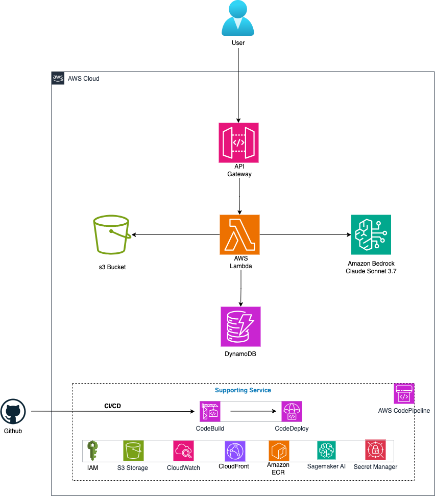

# Food Scanner – Smart Food Identification and Analysis App

## Overview

**Food Scanner** is a smart, serverless application that allows users to scan food items via image upload and receive a complete breakdown of:

- **Food Name**
- **Confidence Score** (model's confidence in the recognition)
- **Food Summary**
- **Nutritional Overview**
- **Health Assessment**

#### The goal is to make dietary awareness fast, accessible, and intelligent using **Computer Vision**, **LLMs via Amazon Bedrock**, and **AWS services**.
#### The use of a custom computer vision model is to enhance the LLM capabilities to recognize food that we care about but it might not know!
---

## How It Works

1. **User uploads a food image** through a front-end or client app.
2. **API Gateway** triggers an **AWS Lambda** function.
3. The Lambda:
   - Stores the image in **Amazon S3**.
   - Sends the image to a **custom computer vision model (efficient net b0)** trained on **SageMaker**.
   - Receives the food name and confidence score.
4. The same Lambda sends this information to **Amazon Bedrock** (Claude Sonnet 3.7).
   - If confidence < 90%, the LLM attempts its own analysis.
   - The LLM enriches the result with a summary, nutrients, and a health score.
5. Final structured output is:
   - Returned to the user.
   - Stored in **Amazon DynamoDB** for future queries and analytics.

---

## Architecture



---

## Technologies and AWS Services

| Service                | Purpose                                                                 |
|------------------------|-------------------------------------------------------------------------|
| **Amazon API Gateway** | Accepts incoming image POST requests                                    |
| **AWS Lambda**         | Orchestrates image processing, LLM calls, and storage                   |
| **Amazon S3**          | Stores the uploaded food images                                         |
| **Amazon Bedrock**     | Uses Claude Sonnet 3.7 for enrichment, fallback classification          |
| **Amazon DynamoDB**    | Stores structured output for persistent access                          |
| **SageMaker Notebooks**| Used to train and evaluate the CV model                                 |
| **AWS SAM**            | Infrastructure as code and automated deployment                         |
| **Amazon ECR**         | Docker images repository                                                |
| **AWS CodePipeline**   | CI/CD                                                                   |

---

## Machine Learning Workflow

### Custom Computer Vision Model

- Developed and trained using **SageMaker Notebooks**.
- Fine-tuned on labeled food image datasets.
- Outputs:
  - `food_name`: Predicted label
  - `confidence_score`: Model certainty (0–100%)

### Bedrock LLM (Claude Sonnet 3.7)

- Triggered for food recognition and additional analysis
- Tasks:
  - Fallback food classification
  - Food description and health insight generation
  - Nutrient summary formatting

---

##  Deployment with AWS SAM

Deployment is managed using **AWS Serverless Application Model (SAM)** for consistency, scalability, and automation.

```bash
/food-scanner/
├── template.yaml         # SAM template definition
├── samconfig.toml
├── Dockerfile
├── utils                 # helper functions
├── main.py               # entry point
├── requirements.txt      # Lambda dependencies
└── README.md
```


### Deployment Steps

```bash
# Build the SAM application
sam build

# Deploy with guided prompts
sam deploy --guided
```


## Sample API response


## CI/CD Implementation with AWS CodePipeline


## Demo on Youtube 
<a href="https://youtu.be/CmCFVQCAC3I" title="YouTube" target="_blank" rel="noreferrer"></a>